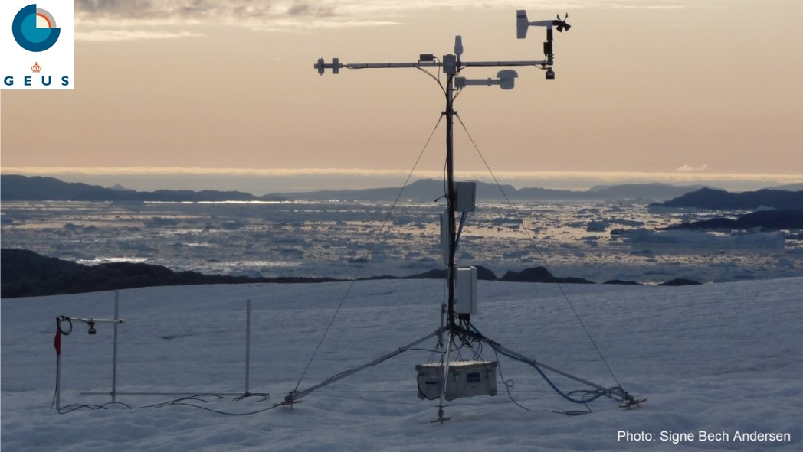

# PROMICE-AWS-toolbox

Processing toolbox for PROMICE Automatic Weather Station (AWS) data, and much more.

This repository contains Python functions for quality check, filtering and adjustment of AWS data. They rely on pandas DataFrames and require a physical copy of the PROMICE data (available here: www.promice.dk).

All functions are located in the script [PROMICE_lib.py](PROMICE_lib.py) and an exemple of how to use them is given in [main,py](main.py).

1. [Pressure transducer processing](#pressure-transducer-processing)
2. [Snow height processing](#snow-height-processing)
3. [Surface height processing: combining pressure transducer and sonic rangers](#start)

# Pressure transducer processing

Processing, filtering and exclusion of ice ablation time series acquired at PROMICE automatic weather stations (www.promice.dk). 

[PROMICE_lib.py](https://github.com/AdrienWehrle/PROMICE_ice_ablation_processing/blob/master/PROMICE_ptd_processing.py) allows to:

## 1. Adjust pressure transducer on specific days
This is done with the file [pres_trans_adj.csv](metadata/pres_trans_adj.csv) which has a simple structure:
```
site, year, adjust_start, adjust_val
NUK_U, 2010, 204, -2.6
...
```
Here at NUK_U, in 2010 on day of the year 204, the pressure transducer depth will be decreased by 2.6m. Add lines to that file to add adjustments.

## 2. Filter data
At the moment there are three filters applied on the pressure transducer depth:
- one hampel filter on the entire record
- a stricter hampel filter for doy<140
- a gradient filter where depth is not allowed to decrease more than a certain threshold within a timestep

## 3. Manually discard data during user-defined periods
This is done with the file [pres_trans_err.csv](metadata/pres_trans_err.csv) which has a simple structure:
```
site, year, err_start, err_end
UPE_U, 2019, 250, 260
...
```
Here at UPE_U, in 2019, the pressure transducer data between day of the year 250 and 260 will be discarded. Add lines to that file if needed.

## Running the pressure transducer processing

```python
	import os
	import PROMICE_ptd_processing as ptd

	try:
		os.mkdir('figures')
	except:
		print('')
		
	df, site = ptd.load_data(file=path_to_PROMICE_file, year='all')

	# processing pressure transducer
	df = ptd.DPT_processing(df, 'all', site, visualisation=True)

	# writing to file
	if len(df)>0:
		df.fillna(-999,inplace=True)
		df.to_csv(site+'_hour_v03_L2.txt', sep="\t")
```
## Output from the pressure transducer processing tool

ptd.DPT_processing gives as output a panda dataframe containing all the columns from the original PROMICE files plus two columns:

**DepthPressureTransducer_Cor_adj(m)** that contains the adjusted and filtered data

**FlagPressureTransducer** that contains a quality flag informing about the data:
```
0 = original data available
1 = no data available    
2 = data available but removed manually
3 = data removed by filter
4 = interpolated
```

# Snow height processing


Processing, filtering and exclusion of the snow height time series acquired at PROMICE automatic weather stations (www.promice.dk). The height of the station boom and the height of a stake assembly above the surface are being measured by SR50 sonic rangers. These data can be used to determine the height of the snow present at the AWS.

[PROMICE_lib.py](https://github.com/AdrienWehrle/PROMICE_ice_ablation_processing/blob/master/PROMICE_ptd_processing.py) allows to:

## 1. Adjust pressure transducer on specific days
This is done with the file [pres_trans_adj.csv](metadata/pres_trans_adj.csv) which has a simple structure:
```
site, year, adjust_start, adjust_val
NUK_U, 2010, 204, -2.6
...
```
Here at NUK_U, in 2010 on day of the year 204, the pressure transducer depth will be decreased by 2.6m. Add lines to that file to add adjustments.

## 2. Filter data
At the moment there are three filters applied on the pressure transducer depth:
- one hampel filter on the entire record
- a stricter hampel filter for doy<140
- a gradient filter where depth is not allowed to decrease more than a certain threshold within a timestep

## 3. Manually discard data during user-defined periods
This is done with the file [pres_trans_err.csv](metadata/pres_trans_err.csv) which has a simple structure:
```
site, year, err_start, err_end
UPE_U, 2019, 250, 260
...
```
Here at UPE_U, in 2019, the pressure transducer data between day of the year 250 and 260 will be discarded. Add lines to that file if needed.

## Running the pressure transducer processing

```python
	import os
	import PROMICE_ptd_processing as ptd

	try:
		os.mkdir('figures')
	except:
		print('')
		
	df, site = ptd.load_data(file=path_to_PROMICE_file, year='all')

	# processing pressure transducer
	df = ptd.DPT_processing(df, 'all', site, visualisation=True)

	# writing to file
	if len(df)>0:
		df.fillna(-999,inplace=True)
		df.to_csv(site+'_hour_v03_L2.txt', sep="\t")
```
## Output from the pressure transducer processing tool

ptd.DPT_processing gives as output a panda dataframe containing all the columns from the original PROMICE files plus two columns:

**DepthPressureTransducer_Cor_adj(m)** that contains the adjusted and filtered data

**FlagPressureTransducer** that contains a quality flag informing about the data:
```
0 = original data available
1 = no data available    
2 = data available but removed manually
3 = data removed by filter
4 = interpolated
```

# Snow height processing


Processing, filtering and exclusion of the snow height time series acquired at PROMICE automatic weather stations (www.promice.dk). The height of the station boom and the height of a stake assembly above the surface are being measured by SR50 sonic rangers. These data can be used to determine the height of the snow present at the AWS.


## Adjustments
[PROMICE_lib.py](https://github.com/AdrienWehrle/PROMICE_ice_ablation_processing/blob/master/PROMICE_ptd_processing.py) addresses the following issues:
- In the previous step, depth of pressure transducer is reset to 0 every 1st of January. Adjust the ice surface measured by the pressure transducer so that it has a continuous value from year to year. 
- Adjust the s


## Running

To combine the pressure transducer and surface height data, you need to process these two variables first, and the use (combine_hs_dpt)[]:

```python
	import PROMICE_lib as pl
    path_to_PROMICE='path_to_PROMICE'
    site = 'QAS_U'
    df, site =pl.load_data(file=path_to_PROMICE+site+'_hour_v03.txt', year='all')
    
    # processing pressure transducer
    df = pl.dpt_proc(df, year='all', site =site, visualisation=True)
    
    if len(df) > 0:    
        # processing snow height
        df = pl.hs_proc(df,site, visualisation=True)
         # combining pressure transducer and surface height to reconstruct the surface heigh
        df = pl.combine_hs_dpt(df, site)
```

## Output

ptd.DPT_processing gives as output a panda dataframe containing all the columns from the original PROMICE files plus four columns:

**DepthPressureTransducer_Cor_adj(m)** that contains the adjusted and filtered pressure transducer data

**SurfaceHeight1_adj(m)** that contains the adjusted and filtered pressure transducer data

**SurfaceHeight2_adj(m)** that contains the adjusted and filtered pressure transducer data

**FlagSurfaceHeight** that contains a quality flag informing about the data:
```
(Under development)
```


